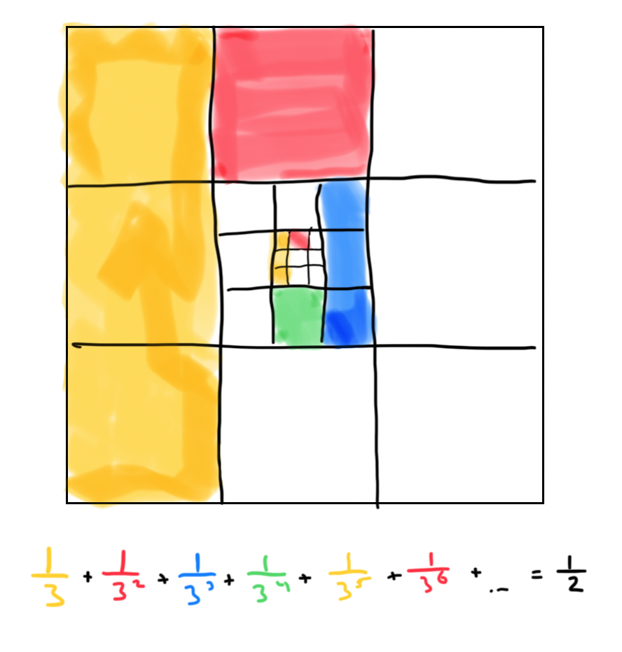

## Geometric Series
A geometric series is the summation of increasingly diminishing terms. $ a $ is
the first term of the sequence, and $ r $ is the common ratio of the series.

$$
S = \sum_{n=1}^{\infty} ar^n = a + ar + ar^2 + ar^3 + ...
$$

## Harmonic Series
The harmonic series has the form of:
$$
\sum_{n=1}^{\infty} \frac{1}{n}
$$
A harmonic series does not converge. 

## Hyperharmonic (p-series)
The hyperharmonic or p-series has the form of
$$
\sum_{n=1}^{\infty} \frac{1}{n^p}
$$
If $ p > 1 $ then the series will converge. We say that a series converges by
the p-test. 

## Telescoping Series