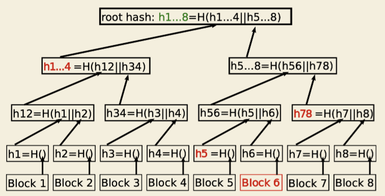

A merkle tree is a binary tree where the root node of the tree is a hash that
represents block chain transactions that are stored as the leaf nodes.

A block may contain thousands of transactions and it would be very inefficient
to store all of the hashes of each transaction. Instead a single transaction is
stored with the block and it is computed from the concatenation of hashes from
the leaf nodes of the tree that contain the transactions.

!!! note
    We can determine if a transaction is a member of a block by checking a few
    things. First we need several pieces of information to do this: we need 
    all of the off-path hashes. These are in bold red in the graphic. With the
    off path hashes we can compute the root hash and compare against the known
    root hash. 