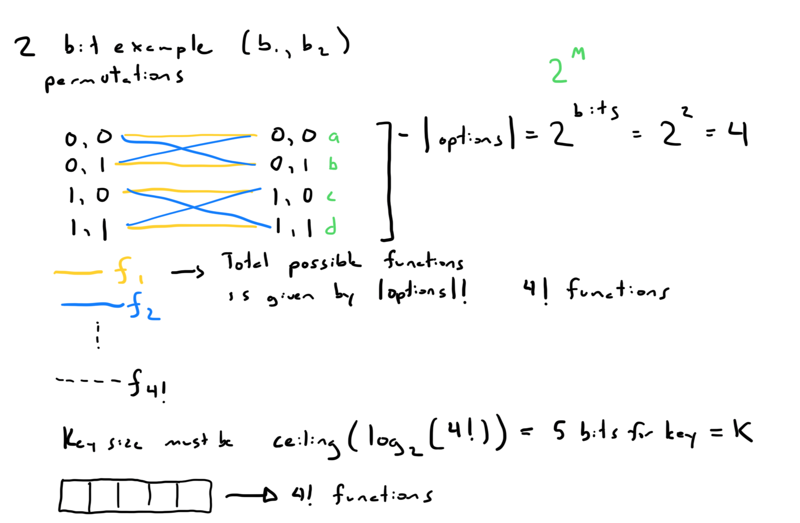
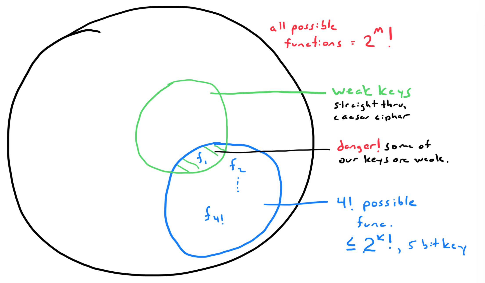

## What are those things?
Ciphers are pairs of algorithms that take some kind of message and create a
confidential message. A plaintext message and a key are given to an 
encryption function and ciphertext is produced from it. Ciphertext and a key
are given to the decryption function and the plaintext is recovered.

Ciphers help prevent eavesdropping. 

Common generic notation for ciphers is noted below. 

$$
\begin{align*}
c = E_k(m) && \text{Encrypt function takes plaintext and key}\\ 
m = D_{k'}(c) && \text{Decrypt function takes ciphertext and key}
\end{align*}
$$
## Disambiguation
### Stream Cipher vs Block Cipher
Stream ciphers and block ciphers differ in the amount of key and plaintext that
are handled at any given time. A block tends to work with a fixed-length chunk 
of bits. A stream will handle bits one at a time with the key a bit at a time.

A weakness in a naively designed block cipher algorithms is when an attacker 
can see blocks that have been duplicatly encoded which reveals more information
than we want to the attacker. A stream cipher wouldn't necessarily have the 
same problem because the symmetric key is turned into a arbitrary-length secret
cipher stream.

The block cipher will also have to be padded if it isn't the correct length.

### Symmetric Encryption vs Asymmetric Ecryption
In symmetric encryption, the parties share the same key. 

In asymmetric encryption, the parties each have a key pair. They have an
encryption **public key**, and a decryption **private key**.

## Cipher Types
### Vernam Cipher (stream)
The vernam cipher has four streams. It begins with a message stream and a key
stream that are xor'd together to form the cipher stream. Then the cipher 
stream is again xor'd with the key stream to recover the output stream which
should be the same as the original input message. 

### Electronic Cookbook (block)
This is the simplist of the block cipher approaches, and we've seen this in use
by AES where it has it as a mode. 

Each block and key are given to the encryption function to generate a 
ciphertext block and then that block and the key are given to the decryption
function to recover the original block.

One of the benefits of this approach is that even if one of the blocks is lost
we can still recover most of the message. When we look at the other chaining 
methods, we see they are not so lucky.

### Cipher Block Chaining (block)
The **chaining** part of the name indicates that the input and output are 
connected in some way. 

For Cipiher Block Chaining, the original message is XOR'd with the previous
cipher text block or the initialization vector if it's the first block, and 
then the XOR'd block is passed into the encryption function.

In the opposite fashion, the cipher text block is passed to the decryption 
function and that output must be XOR'd with the previous cipher text block to
then recover the original plain text.

### Output Feedback (block)

### Cipher Feedback (block)

### Counter Mode

## Non-repudiation

## A Look at the Function Space

In the simple example above, we want to encode 2 bits. We see that the two bits
can have 4 different permutations \( 2^\text{message length}\). As we map from
the 4 inputs to the 4 outputs, there are \(perm!\) possible functions. To 
create a key that can map to all of those functions we would need \( log_2(perm!) \) bits.

When we map this information into the space we see two subsets that exist. One
is the subset of weak keys that would be easily crackable like an identify
function, or the caeser shift function. If the functions encoded by our key
intersect with that set then we have some risky keys in our system that an
attacker could use. We should enhance our design to remove this risk in some
way. 