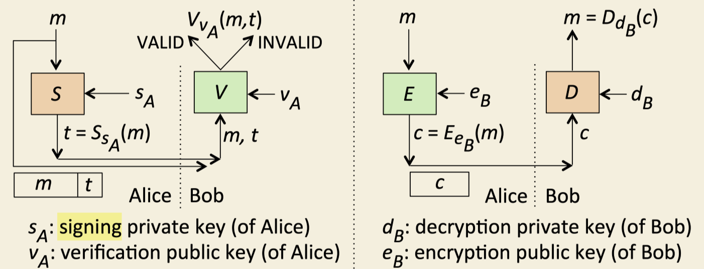

Digital signatures get sent along with messages. They let you know 

- who signed the message (authentication)
- the message is the same as the one that was signed (integrity)
- very good evidence of where it originated (non-repudiation)

Signatures are tags that go along with the message. The tag is produced by
a mathematical function that takes the message and the senders private key as
arguments.

We can see that the signing and encrypting processes differ:

- Signing sends the message (could be in ciphertext or plaintext) along with
the tag.
- The tag is produced by the senders private key which is opposite of public 
key encryption where the receivers public key is used to encrypt the message.
- Instead of encryption and decryption functions to encode ciphertext and 
recover plaintext, we have signing and verification functions to produce 
a tag and to indicate if the message was validly signed. 

## Hashing the Message before Signing
A performance improvement can be made by hashing the message before it is sent.
Hashes are typically much shorter than the message that will be sent, and so
it will be less computationally intense to easily generate a hash, and then
use the hash to produce the tag. 