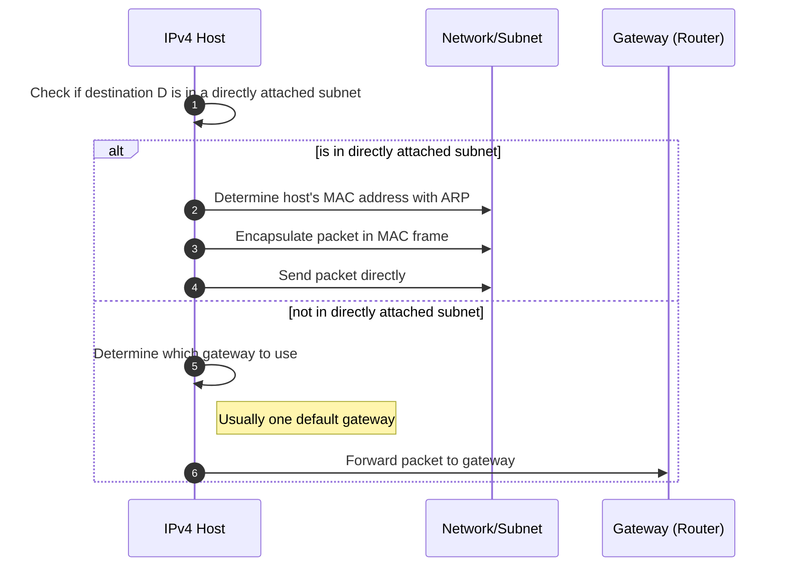
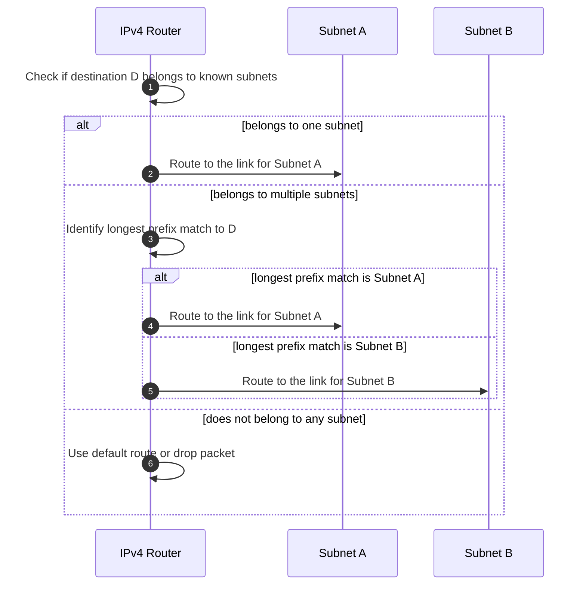
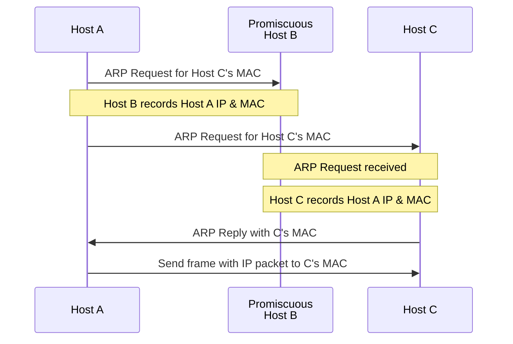

Routers work one level up from where bridges work on the Network layer on the
OSI model, and on the IP layer on the TCP/IP model. 

## Addresses
IP addresses are 32 bits long and commonly displayed as 8 bit numbers in base
10 eg. $ 128.15.0.1 = 10000000.00001111.00000000.00000001 $ 

A slash on a network such as $ 128.10.0.0/16 $ indicates the networks prefix
size. In this case, the first two base 10 numbers identify the network segment 
and then hosts could be addressed from $ 128.10.0.1 - 128.10.255.254 $. The 
last $ .255 $ is reserved for broadcast traffic.
## IP Forwarding
IP packets are forwarded differently depending on if it is the host sending it, 
or if it is the router sending it. 

Forwarding rules do not depend on the source address. Other Network layer 
applications like firewalls may add additional rules based on source address to 
help address this "oversight". 

If a host is sending it, it will generally 
use ARP to discover the IP address if it doesn't already know it and then send 
the packet. If it, it isn't on the same subnet then it will send it to the 
default gateway. 

When you need to send it from the router, the router will check it if the 
packet matches any of its known subnets and route to them; otherwise, it will
check the prefix to see the longest prefix match and route to it. If there are 
still no matches the packet may be dropped or routed to a default gateway. 

## Protocols
### ARP
Even if two hosts on the same Ethernet LAN know each others IP addresses, the 
Ethernet frames that are ultimately sent must have source/destination MAC 
addresses within them. 

The host will maintain a table of IP-to-MAC mappings, and these tend to expire 
to help ensure they stay accurate. The ARP protocol will broadcast on the 
network segment which lets the destination know the sources MAC/IP, and then the
destination will respond with their MAC/IP which will let the source know. If a
host is set to promiscuous mode, they may also collect this information.

After that the source can send Ethernet frames with IP content directed at the 
destination. 

#### Proxy ARP
Routers will often pretend to be a host on a LAN so that they may forward 
traffic intended for that host to a remote LAN. This is helpful to connect 
LANs that whose subnets are physically separated. 
#### Gratuitous ARP
This is sent as a frame broadcast so the host can announce its IP/MAC mapping 
to the network segment. 

This also can be used in failover situations when a host pretends to be the IP/
MAC mapping for a host that has gone down and broadcasts this out. This has 
some problems where it can be used as a man-in-the-middle attack. 

## Weaknesses
### 

## Attacks
### Impersonation via ARP Spoofing
Any host may be in promiscuous mode and then take a MAC address that is in 
traffic, copy it, and then pretend to be that host. Can happen anywhere on the 
segment or over bridged segments. 