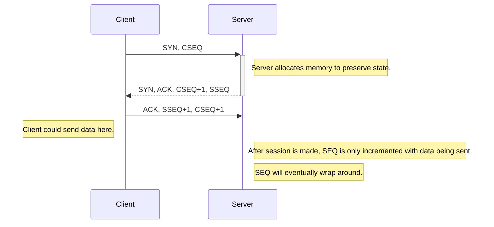
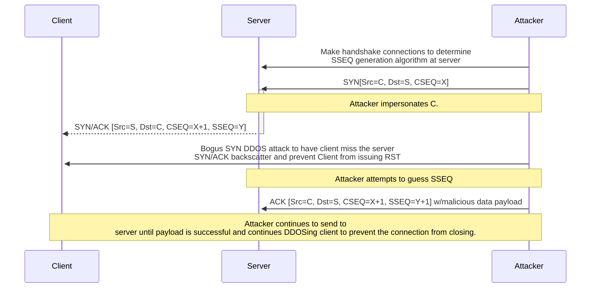

TCP is an IP communication protocol to send data to another host. The TCP 
protocol takes place on the Transport layer of the OSI model, and the TCP/IP 
layer of the TCP/IP model. After hosts and routers have figured out via ARP
how to communicate with other hosts on the segment, and routers know how to 
route IP traffic, then we can set up a connection between two hosts with their
IP addresses and ports. Ports are typically mapped to a process. 

## TCP Handshake
To begin a connection with another host:
1. the client sends a SYN (synchronize), and CSEQ (client sequence number).
2. the destination responds with a SYN, ACK (acknowledgement), CSEQ+1, and SSEQ.
3. the client sends ACK, SSEQ+1, and CSEQ+1 (and optionally data).

## Weaknesses
### Handshake allocates state space at destination
Whenever the TCP handshake is initiated the destination will set aside some 
space to store state information. Under great load this may deplete the space
available at the destination device.    

### Port probing
Requests can be sent to any port address to determine if those services are 
available/online, and then an attack could be tailored to the service at the
port. 

### Sequence Number Predictability
If an attacker can determine the sequence numbers, they can impersonate the 
client and send information. 

## Attacks
### SYN Flood
Since we have servers that will allocate space from clients initiating 
connections, we can rotate in a large load of connection requests from spoofed 
IPs and deplete the space that is allocated for connections.

### Session Hijacking via Initial Sequence Number Impersonation
If these numbers can be guessed then an attacker can impersonate the host and
send traffic to the destination. The attack begins as one way as the attacker
tries to send malicous data that will allow them to gain further control such 
as trying to overwrite the targets login details. 

