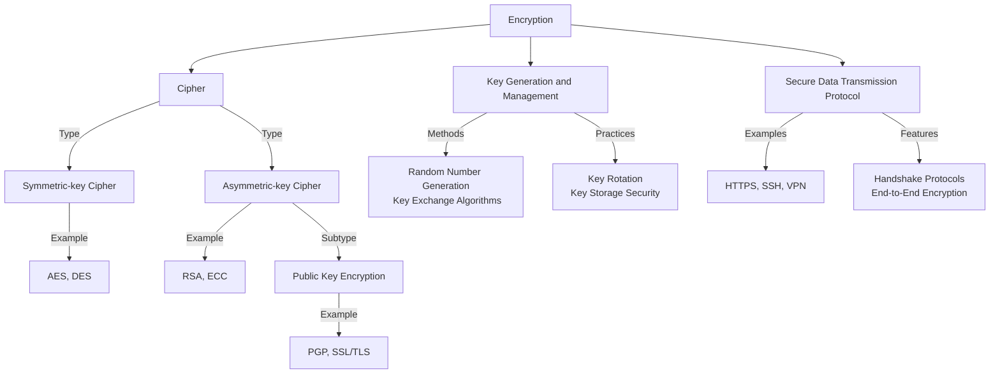

Encryption covers many sub topics such as ciphers, key generation and 
management, and secure data transmission protocol. 

```mermaid
graph TD
    A[Encryption] --> B[Cipher]
    B -->|Type| C[Symmetric-key Cipher]
    B -->|Type| D[Asymmetric-key Cipher]
    C -->|Example| E[AES, DES]
    D -->|Example| F[RSA, ECC]
    D -->|Subtype| G[Public Key Encryption]
    G -->|Example| J[PGP, SSL/TLS]
    A --> H[Key Generation and Management]
    H -->|Methods| I[Random Number Generation</br> Key Exchange Algorithms]
    H -->|Practices| K[Key Rotation</br>Key Storage Security]
    A --> L[Secure Data Transmission Protocol]
    L -->|Examples| M[HTTPS, SSH, VPN]
    L -->|Features| N[Handshake Protocols</br>End-to-End Encryption]

```