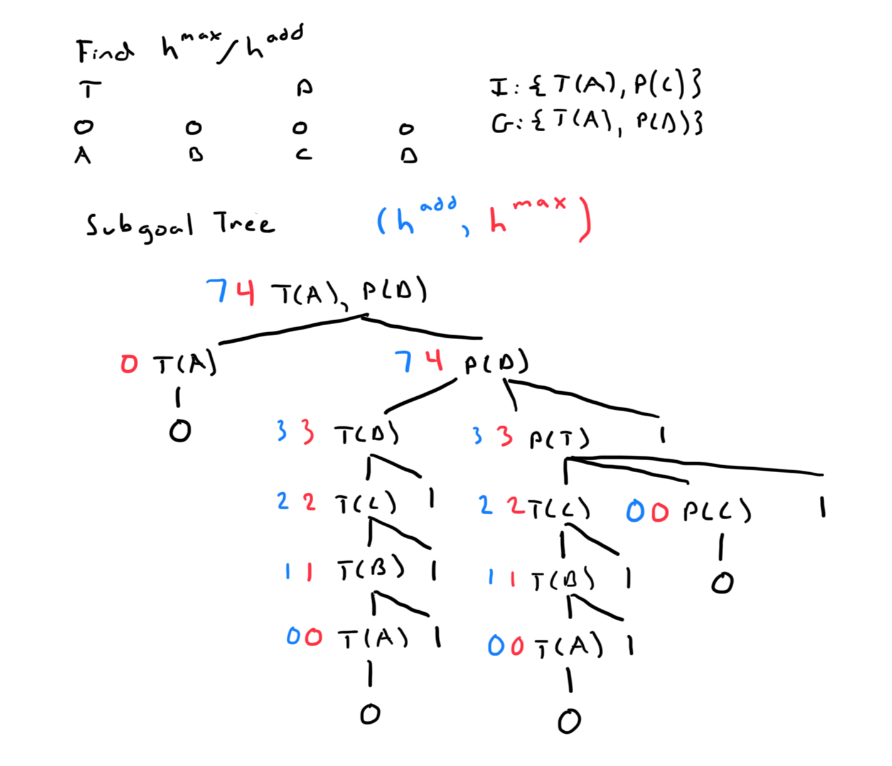

To be able to use A* and other informed search algorithms, we will need to have
a heuristic function that can give us a guess at what the cost to reach the 
goal is. 

Most of the previous heuristics we have seen have involved a relaxation or 
simplification of the problem. STRIPS formalism has several characteristics: 
the propositions, initial state, goal state, actions (preconditions, add effect
and delete effect), and a cost function. What of these could we adjust to create
our heuristic function? The approach we took in class was to remove the delete
effects, so that when we solve the heuristic problem, everything is always true
from our propositions and we only add more true things. This leads to rather
illogical actions in the search tree, but it gives us a heuristic that we can
use with our informed search algorithms.

## Properties of h+
This heuristic function is both consistent (won't re-open nodes) and admissible (can find the 
optimal path). However the problem of finding h+ at every node is NP-hard. There
are three simplifications that can be made to find a simpler heuristic:
- $ h^{add} $ - add up the sub goal costs
- $ h^{max} $ - take the maximum sub goal cost
- $ h^{ff} $ - (fast-forward) - extracts a relaxed plan from the problem and 
    uses the cost of the plan as the heuristic value.

## Subgoal Tree for $ h^{max} $ and $ h^{add} $
