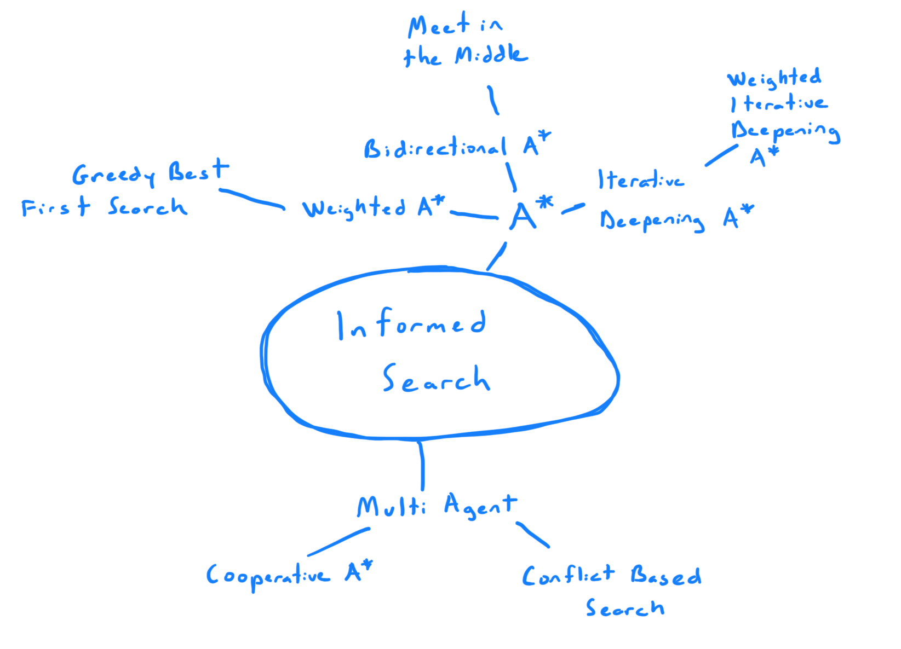

 

Search algorithms such as Dijkstra and Breadth-First Search never have any
information about the end state other than that is what they are looking for. 
An informed search algorithm uses a heuristic function to "inform" the 
algorithm, and in doing so can minimize the time and space complexity to do so.