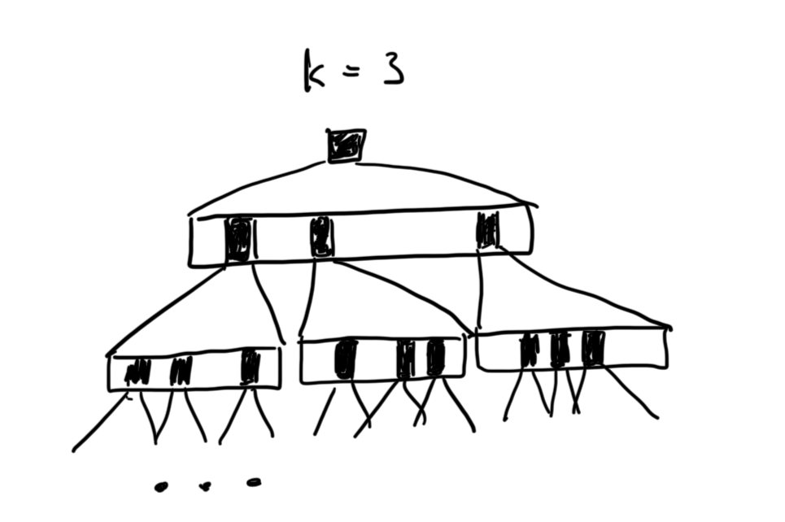

Simulated annealing is limited in that it is only looking at one candidate at a
time. If the simulated annealing heuristic is wrong, then it will take longer
to find some solution. 

Beam search can keep more than one candidate at a time. If it keeps only 1 
candidate then it is equivalent to simulated annealing. If it keeps a very 
large number of candidates then it is equivalent to breadth-first search. 
Adjusting this hyperparameter will depend on the problem at hand.

- $ B $ - set of candidates
- $ K $ - number of candidate solutions to use

As we vary K from 1 to the maximum, we see the transition from hill climbing
to breadth-first search. 

