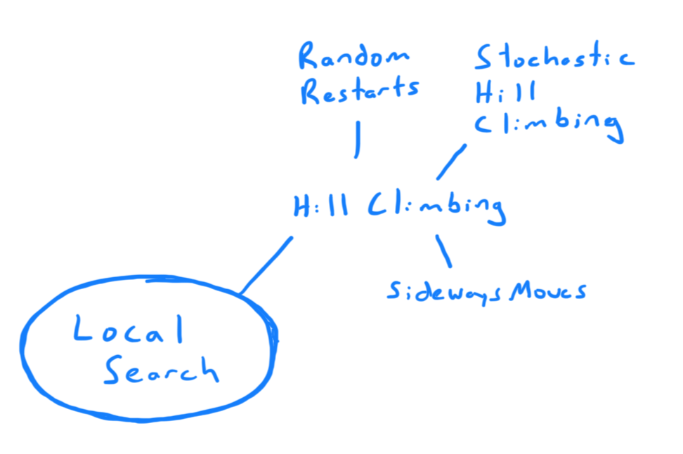

The goal of Local Search is to find a goal configuration and we do not need a
path to reach that goal. Games like n-queens want to know what configuration of
queens will be valid, and problems like the Travelling Salesman Problem just 
needs a set of cities to visit. n-queens is a **pure-search** problem because 
any solution is valid, but TSP is a **pure-optimization** problem because 
although we may have many different solutions - we want the one that is 
optimal (or close to optimal) so the salesman doesn't have to drive so far. 

Local Search problems aren't about actions taken as a pathfinding problem might
reach through a transition function. Instead we look at neighborhoods 
candidates of a given configuration. 

Combinatorial search problems are defined as:

- C is a set of candidates
- $ S \subseteq C $ is a subset of candidates that is a solution
- $ opt \in \{ min, max \} $ is the type of optimization we are looking for
- $ v $ is an objective function mapping the candidate to $ \R $