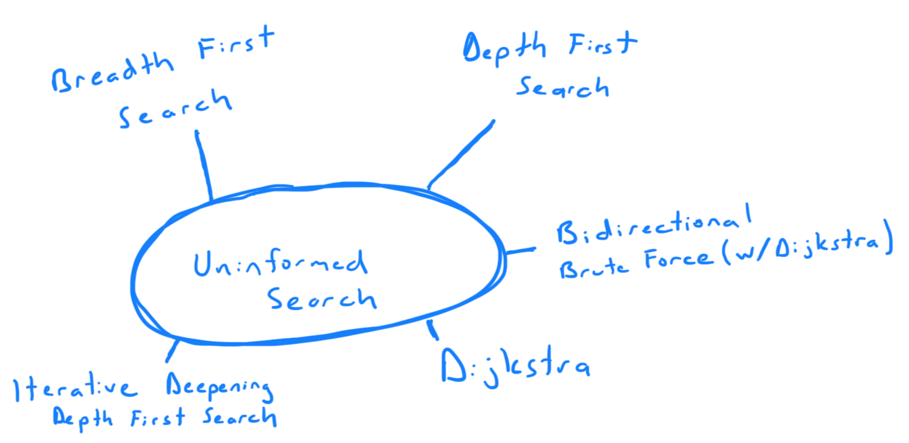

With uninformed search, we don't have information about the goal state, so
we must explore the state space to find the goal. 

Breadth First Search and Dijkstra are similar; however, Dijkstra implements a
priority queue to sort the cost of the nodes whereas BFS only works optimally 
if there are only unit costs. 

Depth First Search and Iterative Deepening Depth First Search are helpful to 
have a smaller memory footprint. Dijkstra and BFS both can take up a lot of 
memory to store states in the CLOSED and OPEN lists. Howevwer DFS and IDDFS 
both suffer from a problem with transpositions. 