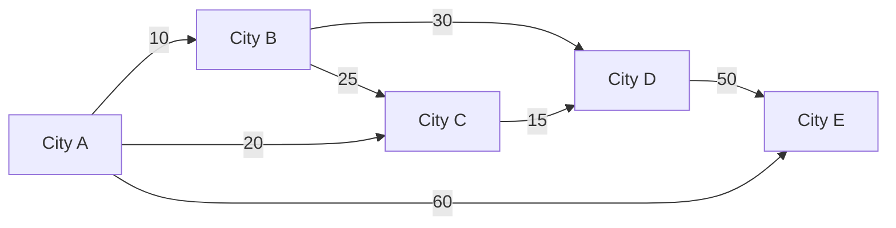
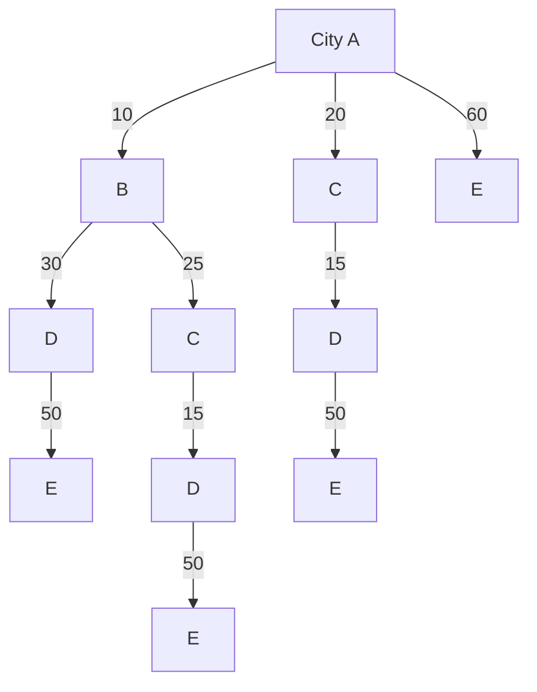
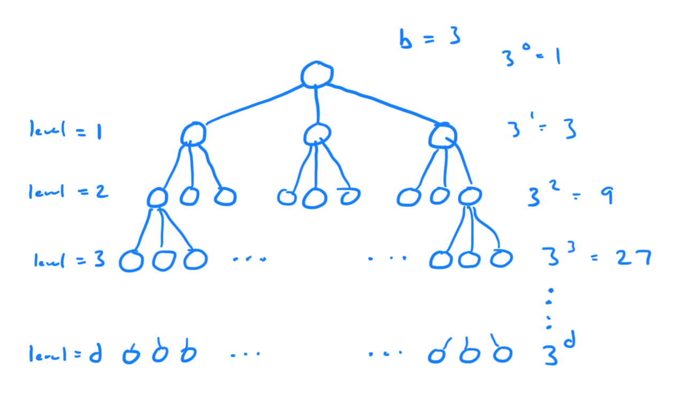

## Search Problem Formation
To formulate a search problem in a state space, we need to have several 
parameters.

- $ G = (S, A) $ A graph with a set of states for the nodes, and edges that define the 
    relations between the nodes.
- $ s_o $ the starting state
- $ s_g $ the goal state
- $ T(s_n) $ the transition function which returns what other states are 
    connected to the input state. 
- $ C(s_n, s_m) $ the cost state which accepts two states and returns the cost
    to connect them. 

When we have this information, we can use various algorithms to search for a 
solution to the problem.

## State Space vs Search Space

The above diagram depicts the state space. It shows all of the various the 
different cities you can be in which represent the different states, and it 
shows the edges that relate one state to another. 

We have a search tree above by selecting City A as the start position and then
calling the transition function recursively until we arrive at a leaf node. 
This could be part of a search problem where we have our state space with nodes
and edges, start node (City A), and goal node (could be City D), and transition
and cost functions. 

## Search Space Size
### Branching Factor
Part of determining the search space size is related to determining the 
number of children a node may have. This is known as the branching factor. 
For example, if we say that generally nodes have 5 child nodes, then the
branching factor is 5. It's typically denoted with $ b $.

### Calculating Search Space Size
We can see from the above search tree that we have:
$$ 3^0 + 3^1 + 3^2 + 3^3 + ... + 3^d $$

And $ 3^d $ is the dominant term which gives the big oh size of the size 
$ O(3^d) $.