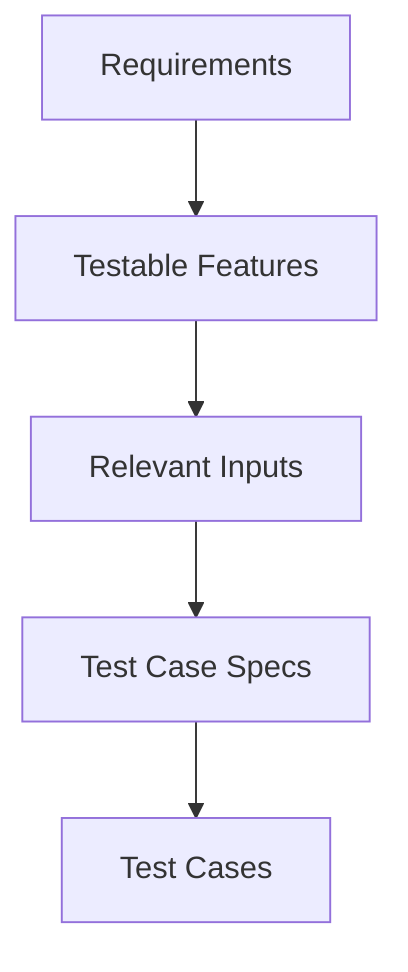

Blackbox testing treats the application under test as an opaque object that we
can't see the internal workings of. When we design tests from a black box
approach we have to think of the requirements made on the system, and exercise
the system from tests upon those requirements.



## Relevant Inputs

### Random testing

The interesting values that we would want to test may not be uniformally 
distributed, and random testing would possible miss these values.

### Boundary Value Testing

We select values that are on the boundary of the input domain or sub-domain. 

#### Boundary Value Analysis

Select boundary values at the minimum, just above the minimum, nominal (mid), 
just below the maximum, and at the maximum.

#### Robustness Testing

Same as boundary value analysis, but include values just outside the boundary. 
This means the minimum value minus one, and the maximum value plus one.

### Partition Testing

The input domain may be divisible into partitions where values in each partition
behave the same. We can then select values from each partition to test instead 
of having to test across the entire domain. 

#### Weak equivalence classes

Weak equivalence testing is done by selecting a value from each class so that 
all classes are covered.

The number of tests needed is defined by the largest number of classes for any
of the variables.

$$
\text{Number of test cases} = \max(|A|, |B|, ..., |Z|)
$$


#### Strong equivalence classes

Strong equivalence testing is done by selecting a value from each class and
creating the cartesian product of all values. 

The number of tests needed is defined by the product of the number of classes
for each variable.

$$
\text{Number of test cases} = |A| \times |B| \times ... \times |Z|
$$

#### Examples

Date can be split up day, month, and year. 

Days depend on the month and on leap years, so we have:
- 1 - 28 days
- 29 days
- 30 days
- 31 days

Months have different day counts:
- month has 31 days
- month has 30 days
- month is february

Year depends on leap years:
- year is not a leap year
- year is a century leap year
- year is a non-century leap year

## Categrory Partition 

This is a similar idea to partition testing (partition is used differently here
and not with relation to equivalence classes), where we divide each of the input
domain into interested categories, and then assign restrictions where possible
to prevent invalid combinations and reduce the number of tests needed.

Each category is subdivided into choices. Those choices may be assigned a
property annotation that restricts the choices that can be made. A value may
be annotated with `[property Empty]`, and then other values can depend on 
whether the property is empty or not. 

### Reduce Combinations

- Property ... if
    - First we mark some category values with a property annotation.
    - Then we can mark other values to depend on that value. 
        - `[property HasQuoteMarks]`
        - `[property Empty]`
        - `[property HasSpecialChars]`
        - `[property HasLetters]`
- Error
    - This marks a value that will be tested once for an error condition.
- Single
    - This marks a value that will be tested once for a single condition.

### Example 
```bash
Paramters:
    Quoting:
        - string does not contain quotes
        - string has one quote
        - string contains more than one quote
    Blanks:
        - string does not contain blanks
        - string contains blanks
    Special Characters:
        - string does not contain special characters
        - string contains special characters
Environment:
    Location:
        - ran on a local machine
        - ran on a remote machine
```
At first edit, this would require `3 * 2 * 2 * 2 = 24` test cases, but could
quickly grow to a much larger size with more parameters or values. We can use
the properties to reduce the total test count.

## Finite State Machines State Diagram

A finite state machine state diagram models the nodes (for states) and edges
(for transitions) of a system. 

A diagram can be used to derive test cases by creating paths through all of the
states and transitions in the machine. 

## Fuzz Testing

Automated testing to feed in invalid, unexpected, or random data to the system
with the goal of finding bugs that challenge system robustness.