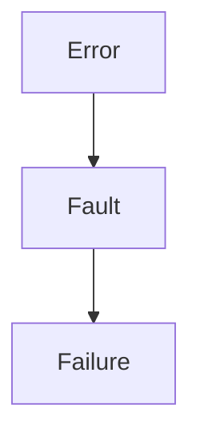
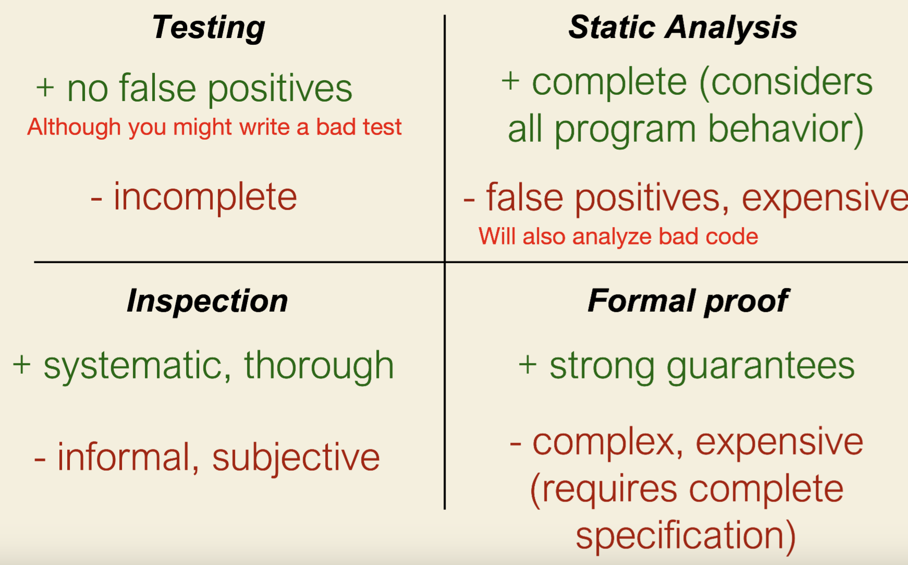
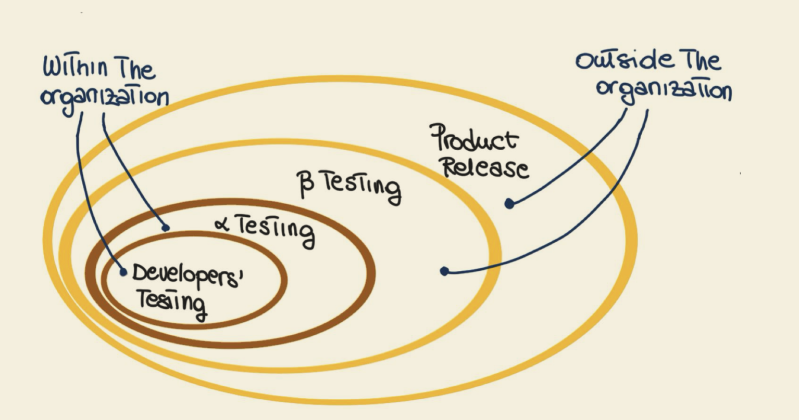

## Definitions

- failure: observable incorrect behaviour from the program
- fault (bug): something in the code that causes a failure.
- error (mistake): the cause of a fault. typically this is a human error.

We may write our code with some problem inside of it that causes a fault. That
fault may cause a failure. 

Though a failure may happen without a fault. 

## Confirmation

### Validation

(Most of) testing can't help with this. Some limited testing can be done through
acceptance testing.

Validations is about building the right system. Rightness is discovered by
communication with client and evaluating whether or not they are getting
what they have asked for. This is approximated by **acceptance testing**. 

### Verification

Testing can help with this. Are we building what we've specified?

We can have a high quality system through verifying it as best as possible, but
it may not be useful. That is the realm of validation - ensuring that we
build the right thing.

## Approaches to Verification

### Testing

### Static Analysis

Verifying with out running the code. We can explore the system for faults by 
looking at the code itself. 

### Code Inspection

When we as a group or individually review our code.

### Formal Proof

Using math.

## Testing Motivations

### What is testing and why do we test?

Running the program with some data.

It helps:
- give us some confidence about the system
- think about the software in terms of concrete behaviour
- help reveal failures
- help assess quality through verification
- learn how the program behaves

Testing does not necessarily reveal correctness, because it is possible we have
programmed the system incorrectly. 

### What do we test?

We may want to investigate many things through testing:
- functionality
- performance
- robustness and reliability
- security
- usability

#### Unit testing

Testing small individual units of code.

#### Integration testing

Testing more than one thing and their interactions.

#### System testing

Typically from the users point of view, these tests should exercise the whole
system.

#### Acceptance testing

Involve the customer to see if we built what they wanted. 

#### Regression testing

Checking to see if our changes broke anything.

### Where do we test?

Alpha testing is done within the company and beta testing is done outside of
the company. 

### How do we select good tests?

We prioritize:
- can it find a bug?
- can it find severe issues?
- can it find common problems?
- does it find distinct issues?

### How do we know when we're done?

We can use coverage criteria to get an idea of our doneness - although it has
to be taken with a grain of salt because acheiving 100% may not be a good goal.

We can pursue:
- statement coverage
- branch coverage
- condition coverage
- etc...

### When can we stop?

When we're out of time, budget or resources. When we've met our goals. Based on
statistical or historical guidance. 

### What are practical concerns with testing?

- race conditions
- human behaviour
- performance bottlenecks
- physical resource issues